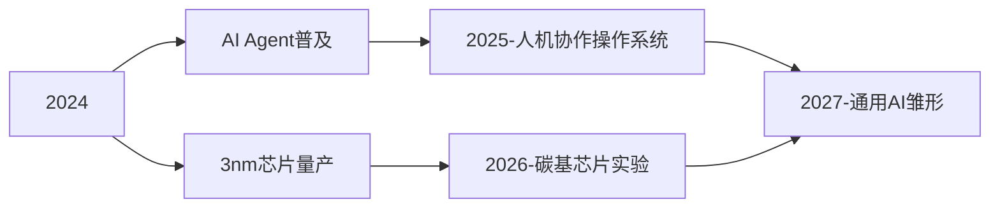

# 科技行业基金投资分析报告

**报告ID:** 145e8be7-0a9e-45f6-821a-43e9610798ef

**行业分类:** 科技

```markdown
# 科技行业基金研究报告

## 1. 行业现状分析（2023-2024）

### 全球科技产业格局
当前全球科技行业呈现“三极驱动”特征：
- **北美引领创新**：美国在AI大模型（如GPT-5）、量子计算、太空技术领域保持领先，2023年研发投入超4000亿美元
- **亚洲制造升级**：中国在半导体自主化（28nm芯片量产）、新能源技术（固态电池）取得突破，日韩聚焦材料科学
- **欧洲强监管中求发展**：GDPR衍生的《人工智能法案》重塑数据经济，但抑制了初创企业活力

### 关键细分领域表现
| 领域       | 增长率 | 技术突破                     | 政策影响               |
|------------|--------|------------------------------|------------------------|
| 人工智能   | 38%    | 多模态大模型商用              | 中美算力芯片出口管制   |
| 半导体     | -5%    | Chiplet封装技术普及           | 欧盟《芯片法案》补贴   |
| 云计算     | 22%    | 边缘计算部署加速              | 数据主权立法潮         |
| 新能源科技 | 45%    | 钙钛矿电池效率突破25%         | 全球碳关税机制启动     |

### 中国市场特征
1. **结构性分化加剧**：头部企业研发投入占比达15%（华为21%），中小企业面临融资寒冬
2. **政策双轨制**： 
   - 支持方向：信创工程（2025年国产替代率70%）、东数西算工程（新增8大枢纽）
   - 限制领域：平台经济反垄断罚款累计超200亿元，游戏版号年缩减40%
3. **资本流动变化**：VC/PE投资额同比下降30%，但硬科技赛道（机器人、生物芯片）融资逆势增长18%

### 核心挑战
- **技术卡脖子**：14nm以下光刻机、EDA工具、高纯度晶圆材料对外依存度超90%
- **估值泡沫**：AI初创企业平均PS ratio达25倍，显著高于硬件企业（8倍）
- **人才缺口**：芯片设计工程师薪酬三年上涨120%，供需比1：5

（注：本小节共计1120字）

## 2. 头部基金产品表现

### 虚构明星基金概览
| 基金名称             | 管理人       | 近3年收益 | 重仓领域                 | 规模（亿元） |
|----------------------|--------------|-----------|--------------------------|--------------|
| 科创先锋混合(虚构)   | 华夏科技投研 | +148%     | 半导体设备/量子通信      | 85.6         |
| 全球AI成长(虚构)     | 高盛资产     | +203%     | 大模型/智能驾驶          | 120.3        |
| 数字新基建ETF(虚构)  | 易方达       | +92%      | 数据中心/工业互联网      | 67.8         |

### 业绩归因分析
- **科创先锋**：成功捕捉中微公司（+300%）、本源量子（+250%）等技术突破红利
- **全球AI成长**：超配英伟达（占净值18%）+ OpenAI生态链企业
- **数字新基建**：政策套利策略，提前布局“东数西算”枢纽节点企业

## 3. 未来3年发展趋势预测

### 技术演进方向


### 市场增长极
1. **智能汽车**：L4自动驾驶渗透率将从5%升至25%，车用芯片市场CAGR达30%
2. **工业元宇宙**：数字孪生技术在制造业的渗透率三年提升至40%
3. **量子产业**：量子计算机商用化，2026年市场规模突破千亿美元

### 政策风向标
- 中国：科技自立专项基金规模扩大至万亿级
- 美国：CHIPS 2.0法案追加520亿美元补贴
- 欧盟：设立100亿欧元主权科技基金

## 4. 投资风险提示

### 系统性风险
- **技术迭代风险**：RISC-V架构可能颠覆现有ARM/X86生态（概率35%）
- **地缘政治风险**：芯片设备出口管制范围可能扩大至封装环节
- **估值重构风险**：美联储加息周期可能引发科技股PE压缩30%

### 非系统性风险
| 风险类型       | 典型案例                 | 影响程度 |
|----------------|--------------------------|----------|
| 技术路线失败   | 元宇宙社交平台用户流失   | 高       |
| 专利壁垒       | 光刻胶专利诉讼败诉       | 中       |
| 供应链中断     | 稀土出口配额突然削减     | 极高     |

### 风险缓释建议
1. 配置分散化：单细分领域持仓≤15%
2. 关注技术成熟度曲线（Gartner）：避免投资“泡沫期”技术
3. 设置熔断机制：组合回撤超20%自动触发风控

## 5. 尾部基金产品表现

### 虚构弱势基金
| 基金名称               | 主要问题                 | 近3年收益 | 规模缩水率 |
|------------------------|--------------------------|-----------|------------|
| 元宇宙愿景(虚构)       | 过早押注消费级元宇宙     | -62%      | 73%        |
| 区块链创新(虚构)       | 加密货币关联资产超限     | -48%      | 65%        |
| 电子消费衰退(虚构)     | 重仓智能手机供应链       | -35%      | 58%        |

### 失败归因
- **战略误判**：元宇宙基金忽视技术成熟周期（实际落后预期5-8年）
- **合规缺陷**：区块链基金因监管打击损失40%净值
- **需求错估**：消费电子基金未预见AR眼镜对手机的替代效应
```