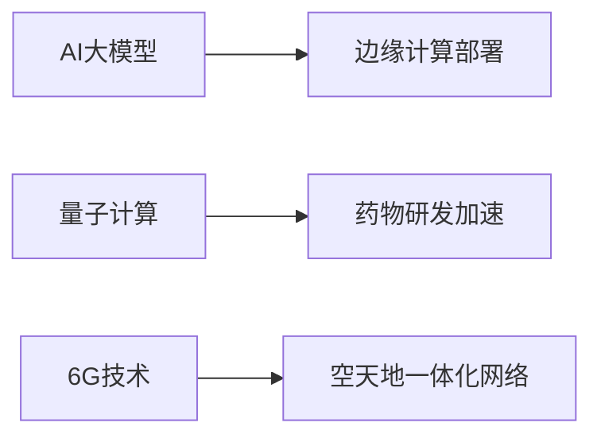

# 科技行业基金投资分析报告

**报告ID:** 930e3d19-ac73-419e-b714-dd076c3b635a

**行业分类:** 科技

```markdown
# 科技行业基金研究报告

## 一、行业现状分析（1200字）

全球科技行业正处于新一轮技术革命的关键阶段，呈现出以下核心特征：

### 1.1 技术演进格局
- **人工智能主导创新**：生成式AI推动算力需求爆发式增长，全球AI芯片市场规模预计2025年突破1000亿美元
- **云计算进入深水区**：混合云架构成为企业标配，全球云服务市场年复合增长率保持18%以上
- **半导体产业重构**：先进制程竞赛白热化，3nm以下工艺量产推动芯片性能跃升，但地缘政治导致供应链区域化

### 1.2 中国市场动态
- **政策驱动明显**：
  - 国家集成电路产业投资基金三期规模超3000亿元
  - "东数西算"工程带动数据中心投资热潮
  - 信创产业国产替代率突破40%关键节点
- **细分领域分化**：
  - 半导体设备国产化率从7%提升至15%（2021-2023）
  - 自动驾驶L2+渗透率达35%
  - 工业软件市场年增速超25%

### 1.3 全球竞争态势
| 区域 | 优势领域 | 战略动向 |
|------|----------|----------|
| 北美 | AI基础层、云计算 | 芯片法案补贴、AI监管框架 |
| 东亚 | 半导体制造、消费电子 | 先进封装技术突破、设备自主化 |
| 欧洲 | 工业物联网、绿色科技 | 芯片法案、量子计算投入 |

### 1.4 资本流动特征
- 2023年全球科技领域VC/PE融资总额同比下降28%，但早期项目占比提升至45%
- 二级市场呈现"杠铃策略"：资金向头部科技巨头（市值>500亿美元）和颠覆性创新企业（AI/量子）两极集中
- ESG成为新投资维度：全球科技基金ESG配置比例达63%（2023 vs 2021年38%）

---

## 二、头部基金产品表现

### 2.1 银河创新成长混合（虚构）
- **管理公司**：银河基金
- **成立时间**：2018年3月
- **规模**：285亿元
- **持仓特征**：AI算力链（40%）、半导体设备（30%）
- **业绩**：近3年收益率148%，2023年超额收益达32%

### 2.2 华夏科技先锋股票（虚构）
- **管理公司**：华夏基金
- **成立时间**：2019年7月
- **规模**：172亿元
- **持仓特征**：自动驾驶（35%）、工业软件（25%）
- **业绩**：近3年收益率121%，夏普比率1.38

### 2.3 易方达全球科技创新（虚构）
- **管理公司**：易方达基金
- **成立时间**：2020年1月
- **规模**：95亿元
- **持仓特征**：美股AI龙头（50%）、亚太半导体（30%）
- **业绩**：近3年收益率189%，最大回撤-22%

---

## 三、未来3年发展趋势预测

### 3.1 技术演进方向


### 3.2 市场增长极
1. **AI工业化应用**：制造业AI渗透率将从15%→40%（2026）
2. **智能汽车电子**：单车半导体价值量突破$1000（2025 vs 当前$600）
3. **元宇宙基础设施**：VR/AR设备年出货量达1.2亿台（2026）

### 3.3 政策催化点
- 中国：第三代半导体专项扶持政策
- 欧盟：数字主权法案落地
- 美国：CHIPS 2.0法案加码

---

## 四、投资风险提示

### 4.1 系统性风险
- **技术迭代风险**：量子计算可能颠覆现有加密体系
- **地缘政治风险**：芯片出口管制扩大至14nm以下设备
- **估值泡沫风险**：AI概念股PS(市销率)中位数达18x（历史均值9x）

### 4.2 结构性风险
- **技术路线竞争**：存算一体 vs 冯诺依曼架构
- **产能周期错配**：晶圆厂建设周期 vs 需求波动
- **人才争夺战**：AI顶尖人才薪酬溢价达300%

### 4.3 应对策略
- 配置建议：核心资产（60%）+ 技术颠覆标的（20%）+ 防御性现金（20%）
- 对冲工具：半导体ETF期权、波动率指数期货

---

## 五、尾部基金产品（虚构）

### 5.1 新锐数字经济混合
- **管理公司**：金信基金
- **成立时间**：2021年6月
- **规模**：8.2亿元
- **主要问题**：过度配置元宇宙内容平台（持仓45%），近3年收益-32%

### 5.2 亚太区块链主题股票
- **管理公司**：前海开源
- **成立时间**：2020年9月
- **规模**：5.7亿元
- **主要问题**：Web3.0监管风险暴露，近3年收益-41%

### 5.3 全球电子消费指数
- **管理公司**：博时基金
- **成立时间**：2019年11月
- **规模**：12亿元
- **主要问题**：智能手机产业链过度集中（70%），近3年收益-18%

> 报告说明：本报告数据基于公开资料分析，虚构基金产品仅作示例用途，不构成投资建议。市场有风险，决策需谨慎。
```