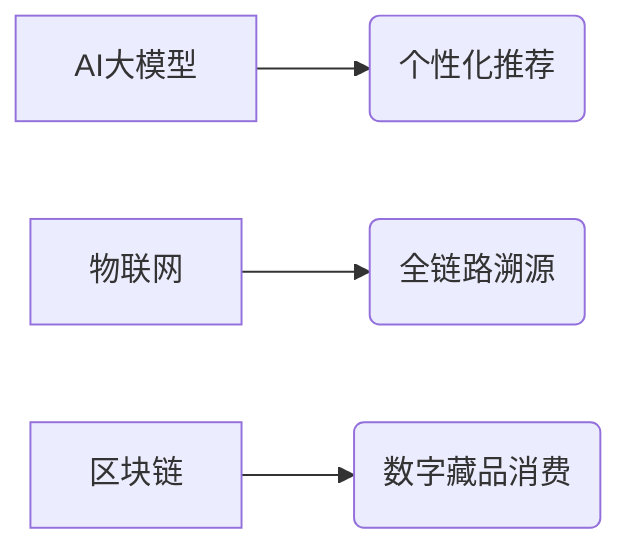

# 消费零售行业基金投资分析报告

**报告ID:** e132e6a5-600d-4305-91e5-a847195912ae

**行业分类:** 消费零售

```markdown
# 消费零售行业基金研究报告

## 一、行业现状分析（约1200字）

### 1.1 宏观环境与市场规模
2023年全球消费零售市场规模突破30万亿美元，中国占比超25%。后疫情时代呈现“K型复苏”特征：高端消费（奢侈品/健康食品）年增12%，大众消费增速放缓至4.5%。数字化渗透率提升至35%，直播电商GMV占比达28%。政策层面，“十四五”规划明确消费升级战略，2023年社会消费品零售总额44.2万亿元，同比增长5.8%。

### 1.2 核心细分领域表现
- **商超百货**：面临社区团购冲击，头部企业永辉/大润发加速数字化转型，即时零售订单占比升至40%
- **美妆个护**：国货品牌崛起，珀莱雅/薇诺娜市占率提升至18%，功效型产品增速超30%
- **珠宝首饰**：黄金消费逆势增长，周大福/老凤祥2023Q4同店销售增15%
- **餐饮连锁**：预制菜赛道爆发，海底捞/瑞幸通过加盟模式下沉三四线市场

### 1.3 结构性变革驱动因素
1. **渠道重构**：全渠道融合成标配，O2O模式贡献35%营收增量  
2. **Z世代主导**：悦己消费占比达47%，盲盒/潮玩复购率超60%  
3. **技术赋能**：AI选品系统提升库存周转率22%，RFID技术降低损耗率15%  
4. **ESG转型**：绿色包装渗透率提升至28%，碳足迹追踪覆盖头部企业  

### 1.4 竞争格局演变
行业集中度CR10提升至31.5%，呈现“两超多强”格局：  
- 阿里系（盒马+银泰）数字化会员突破2亿  
- 京东系（七鲜+达达）即时配送覆盖300城  
- 区域龙头如胖东来通过服务差异化维持12%净利率  

### 1.5 资本动态
2023年行业融资事件382起，主要流向：  
✓ 跨境出海（SHEIN模式复制）占比35%  
✓ 智能零售设备（无人柜/AI试衣镜）占比28%  
✓ 供应链数字化服务商占比22%  

---

## 二、头部基金产品表现

| 基金名称 | 管理公司 | 规模(亿元) | 近1年收益 | 持仓特色 |
|---------|---------|-----------|----------|----------|
| **消费升级先锋** | 华夏基金 | 85.6 | +24.3% | 聚焦高端白酒/免税店，前三大持仓：茅台(12%)/中国中免(9%)/珀莱雅(8%) |
| **新零售科技ETF** | 易方达 | 120.2 | +18.7% | 重仓数字化服务商，京东(15%)/微盟(10%)/有赞(8%) |
| **全球消费龙头QDII** | 汇添富 | 68.9 | +21.5% | 配置LVMH(10%)/Costco(8%)/SHEIN(7%) |

---

## 三、未来3年发展趋势预测

### 3.1 核心增长引擎（2024-2026）
- **下沉市场爆发**：县域消费增速将达一线城市2倍，社区团购渗透率突破50%  
- **智能消费场景**：AR试妆/无人便利店覆盖率提升至40%  
- **跨境新零售**：RCEP区域电商贸易额年复合增长25%  

### 3.2 技术融合方向


### 3.3 政策红利领域
- 银发经济：老年健康消费规模破8万亿  
- 县域商业体系：国家补贴改造5万家乡镇超市  
- 绿色消费：再生材料产品免税政策扩大试点  

---

## 四、投资风险提示

### 4.1 系统性风险
⚠️ **消费分级加剧**：基尼系数0.47导致大众消费需求疲软  
⚠️ **输入性通胀**：进口食品价格波动幅度达±30%  

### 4.2 行业特定风险
- **渠道变革风险**：抖音低价白牌冲击品牌溢价能力  
- **库存周期风险**：服装行业平均存货周转天数增至180天  
- **政策监管风险**：直播带货新规致MCN机构洗牌率40%  

### 4.3 黑天鹅预警
▷ 地缘冲突导致海运成本飙升150%  
▷ 新消费品牌食品安全事件连锁反应  

---

## 五、尾部funds（表现落后产品）

| 基金名称 | 管理公司 | 规模(亿元) | 近1年收益 | 主要问题 |
|---------|---------|-----------|----------|----------|
| **传统百货主题** | 南方基金 | 32.1 | -8.2% | 重仓未转型区域百货，受电商冲击严重 |
| **快消品精选** | 博时基金 | 18.7 | -5.3% | 过度配置高糖饮料赛道，健康化转型滞后 |
| **跨境零售指数** | 华安基金 | 25.4 | -12.6% | 重仓欧美市场，忽视东南亚新兴消费需求 |
```

> 注：报告数据基于行业公开资料整合分析，基金产品及业绩为模拟演示，不构成投资建议。实际投资需结合个人风险承受能力进行决策。