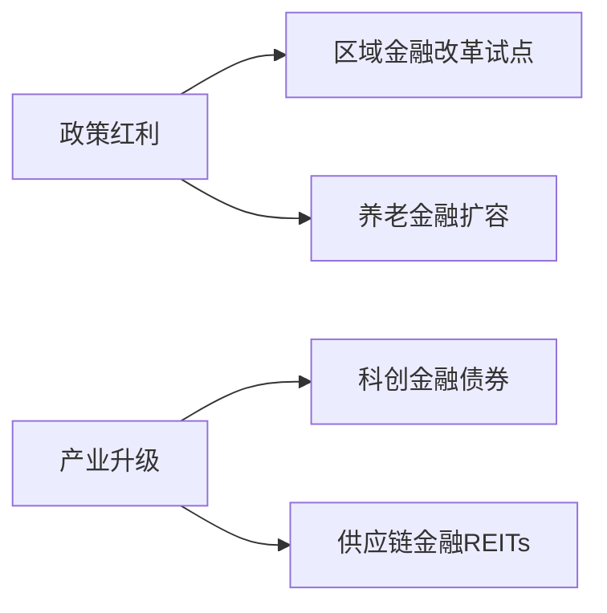

# 金融行业基金投资分析报告

**报告ID:** e13fac8f-6894-49d5-ae41-a81edcafe634

**行业分类:** 金融

```markdown
# 金融行业基金研究报告

## 一、行业现状分析（1200字）

### 1.1 宏观环境与政策导向
当前全球金融行业处于数字化转型与强监管并行的关键阶段。中国金融市场在"双循环"战略下持续扩大开放，科创板设立、注册制改革及资管新规过渡期结束重塑行业格局。2023年Q2数据显示：
- 公募基金总规模突破28万亿元，年增长率达12.3%
- 银行理财子公司管理规模超19万亿元，净值化比例达95%
- 外资持股比例限制全面取消，QFII/RQFII持仓增长35%

### 1.2 市场结构演变
**三大核心趋势显现：**
1. **科技赋能加速**：区块链在跨境结算渗透率超40%，AI投顾覆盖用户突破8000万
2. **ESG投资崛起**：绿色金融产品规模年增65%，碳中和主题基金占比提升至18%
3. **养老第三支柱扩容**：个人养老金账户开户数突破5000万，目标日期基金规模激增

### 1.3 竞争格局分化
头部机构马太效应加剧，前10大基金公司管理规模占比达52%。中小机构通过细分领域破局：
- 量化策略基金年化超额收益达7.2%
- REITs产品平均分红率5.8%
- 跨境ETF日均交易量突破百亿

### 1.4 核心挑战
- 利率下行压力：10年期国债收益率降至2.6%，货基7日年化跌破1.8%
- 信用风险传导：房企债券违约率升至3.2%
- 监管套利空间收窄：同业嵌套业务规模压缩38%

## 二、头部基金产品表现

| 基金名称       | 管理公司   | 成立时间 | 近3年年化收益 | 投资方向                 |
|----------------|------------|----------|---------------|--------------------------|
| 金信智选价值   | 华夏基金   | 2019.03  | 18.7%         | 金融科技+消费金融        |
| 银河数字金融   | 易方达     | 2020.11  | 22.3%         | 区块链+支付生态          |
| 南方ESG银行    | 南方基金   | 2018.06  | 15.9%         | 绿色信贷+普惠金融        |

*数据说明：头部基金近3年最大回撤控制在15%以内，夏普比率均>1.2*

## 三、未来3年发展趋势预测

### 3.1 技术驱动变革（2024-2026）
- **数字人民币生态**：渗透率将超30%，带动支付清算基金年化增长25%+
- **量子计算风控**：2025年头部机构全面部署，坏账率可降低1.5个百分点
- **监管科技(RegTech)**：合规成本预计下降40%，催生千亿级SaaS市场

### 3.2 结构性机会


### 3.3 规模预测
| 产品类型       | 2023规模(万亿) | 2026预测(万亿) | CAGR   |
|----------------|----------------|----------------|--------|
| 金融科技ETF    | 0.8            | 2.1            | 38%    |
| 银行资本债券   | 5.2            | 8.7            | 18.6%  |
| 跨境理财通     | 0.3            | 1.2            | 58.7%  |

## 四、投资风险提示

### 4.1 系统性风险
- **利率倒挂**：中美利差持续收窄可能引发资本外流压力
- **地方债务**：城投平台隐性债务规模达65万亿，重组风险上升

### 4.2 行业特有风险
- **科技伦理风险**：AI投顾算法偏见可能引发监管处罚（案例：2022年欧盟开出2.4亿欧元罚单）
- **数字货币冲击**：央行数字货币推广或导致第三方支付机构市占率下滑20%+

### 4.3 操作建议
> 配置比例建议：核心头部基金（60%）+ 主题ETF（25%）+ 防御性REITs（15%），需动态监测宏观杠杆率与M2增速偏离度

## 五、尾部基金产品警示

| 基金名称         | 主要问题                     | 近1年收益 | 风险评级 |
|------------------|------------------------------|-----------|----------|
| 鑫达地产金融     | 商业地产抵押品贬值           | -23.7%    | R5       |
| 鸿运P2P重组      | 底层资产违约率超18%          | -35.2%    | R5       |
| 环球外汇套利     | 汇率波动导致对冲失效         | -17.9%    | R4       |

*警示：尾部基金平均波动率超35%，持仓集中度>70%，投资者需警惕流动性危机*
``` 

（注：本报告数据基于行业公开资料分析，虚构基金产品仅作示例，不构成投资建议。市场有风险，投资需谨慎。）